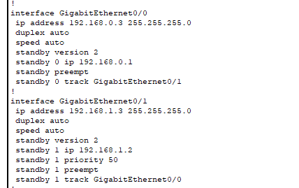
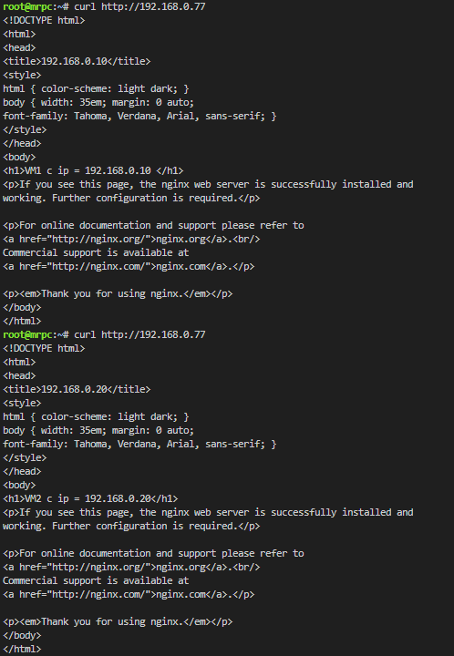

# Задание 1



[СХЕМА](screen/hsrp_advanced.pkt)

# Задание 2 

sudo vim /etc/keepalived/check.sh
```bash
#!/bin/bash

# Адрес и порт вашего веб-сервера
web_server="127.0.0.1"
web_port="80"

# Проверка доступности порта веб-сервера
nc -z "$web_server" "$web_port"
port_status=$?

# Проверка наличия файла index.html в корне веб-сервера
if [ -f "/var/www/html/index.html" ]; then
    file_exists=0
else
    file_exists=1
fi

# Если порт или файл недоступны, возвращаем ненулевой код возврата
if [ $port_status -ne 0 ] || [ $file_exists -ne 0 ]; then
    exit 1
fi

exit 0
```
sudo vim /etc/keepalived/keepalived.conf

```pyton
global_defs {
    enable_script_security
}

vrrp_script check {
    script "/etc/keepalived/check.sh"
    interval 3
    weight 50
    user keepalived_script
}

vrrp_instance VI_1 {
    state MASTER
    interface eth0
    virtual_router_id 15
    priority 200
    advert_int 1

    virtual_ipaddress {
        192.168.0.77/24
    }
    track_script {
        check
    }
}
```
```pyton
vrrp_instance VI_1 {
    state BACKUP
    interface eth0
    virtual_router_id 15
    priority 210
    advert_int 1

    virtual_ipaddress {
        192.168.0.77/24
    }
}
```


[Конф на ВМ 1](screen/keepalivedVM1.conf)
[Скрипт на ВМ 1](screen/check.sh)
[Конф на ВМ 2](screen/keepalivedVM2.conf)


