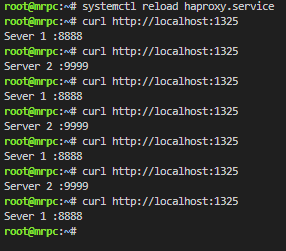
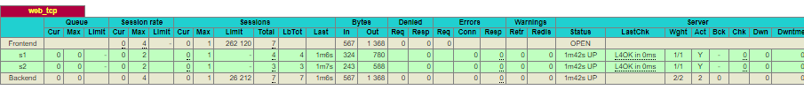
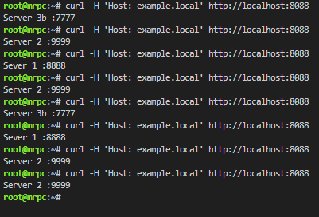
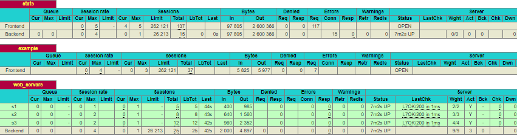

# Задание 1
```
mkdir http1
mkdir http2
nano http1/index.html
nano http2/index.html
python3 -m http.server 8888 --bind 0.0.0.0
python3 -m http.server 9999 --bind 0.0.0.0
```
```
apt install haproxy
vim /etc/haproxu/haproxy.cfg
```
```python
listen stats  # веб-страница со статистикой
    bind			:888
    mode			http
    stats			enable
	stats uri		/stats
    stats refresh	5s
    stats realm		Haproxy\ Statistics

frontend example  # секция фронтенд
    mode http
    bind :8088
    #default_backend web_servers
	  acl ACL_example.com hdr(host) -i example.com
	  use_backend web_servers if ACL_example.com

backend web_servers    # секция бэкенд
    mode http
    balance roundrobin
    option httpchk
    http-check send meth GET uri /index.html
    server s1 127.0.0.1:8888 check
    server s2 127.0.0.1:9999 check


listen web_tcp
	bind :1325
	server s1 127.0.0.1:8888 check inter 3s
	server s2 127.0.0.1:9999 check inter 3s
```
systemctl reload haproxy.service




# Задание 2

```bash
listen stats  # веб-страница со статистикой
	bind			:888
	mode			http
	stats			enable
	stats uri		/stats
	stats refresh	5s
	stats realm		Haproxy\ Statistics

frontend example  # секция фронтенд
    mode http
    bind :8088
	  acl ACL_example.local hdr(host) -i example.local
	  use_backend web_servers if ACL_example.local

backend web_servers    # секция бэкенд
    mode 		http
    balance 	roundrobin
    option 		httpchk
    http-check send meth GET uri /index.html
    server s1 127.0.0.1:7777 weight 2 check
	  server s2 127.0.0.1:8888 weight 3 check
    server s3 127.0.0.1:9999 weight 4 check

```




