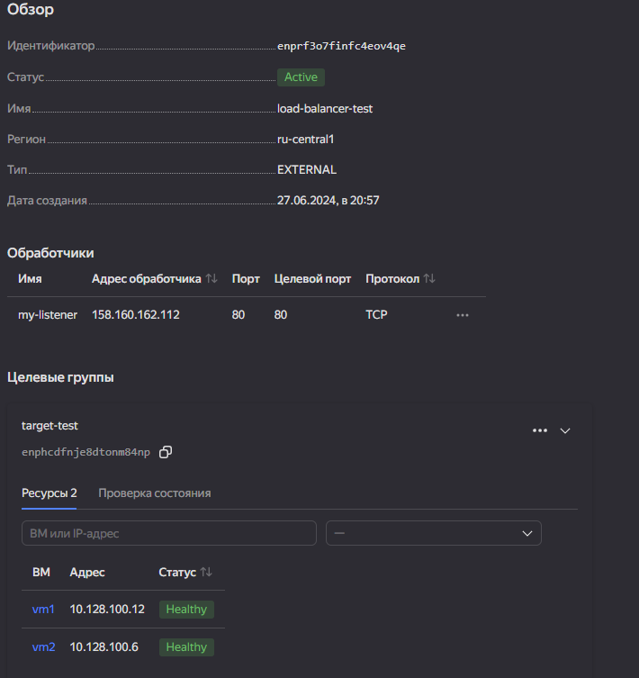
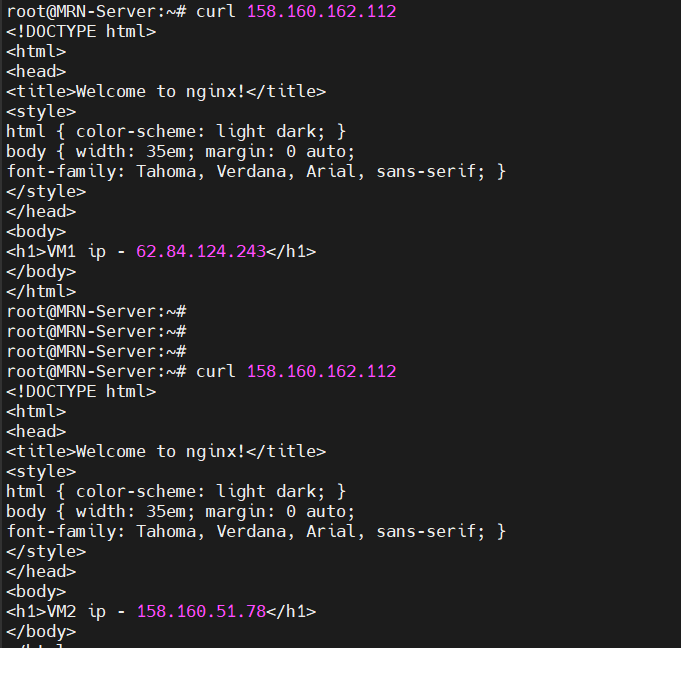
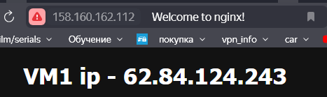
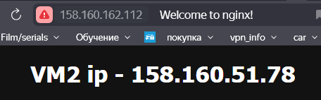

# Задание 1

### Описание действий

1. Установил на Windows terraform
2. Добавил PATH: export PATH=$PATH:C:\Users\valen\terraform.exe
3. Создал файл terraform.rc
```yaml
provider_installation {
  network_mirror {
    url = "https://terraform-mirror.yandexcloud.net/"
    include = &#91;"registry.terraform.io/*/*"]
  }
  direct {
    exclude = &#91;"registry.terraform.io/*/*"]
  }
}
```
4. terraform init

6. Создал файл [main.tf](file+screenshots/main.tf)

7. Создал файл [varible.tf](file+screenshots/varible.tf)

8. Создал файл [terraform.tfvars](file+screenshots/terraform.tfvars)
   
9. Создал файл [cloud-conf.yaml](file+screenshots/cloud-conf.yaml)
    
10. Создал файл [outputs.tf](file+screenshots/outputs.tf)






